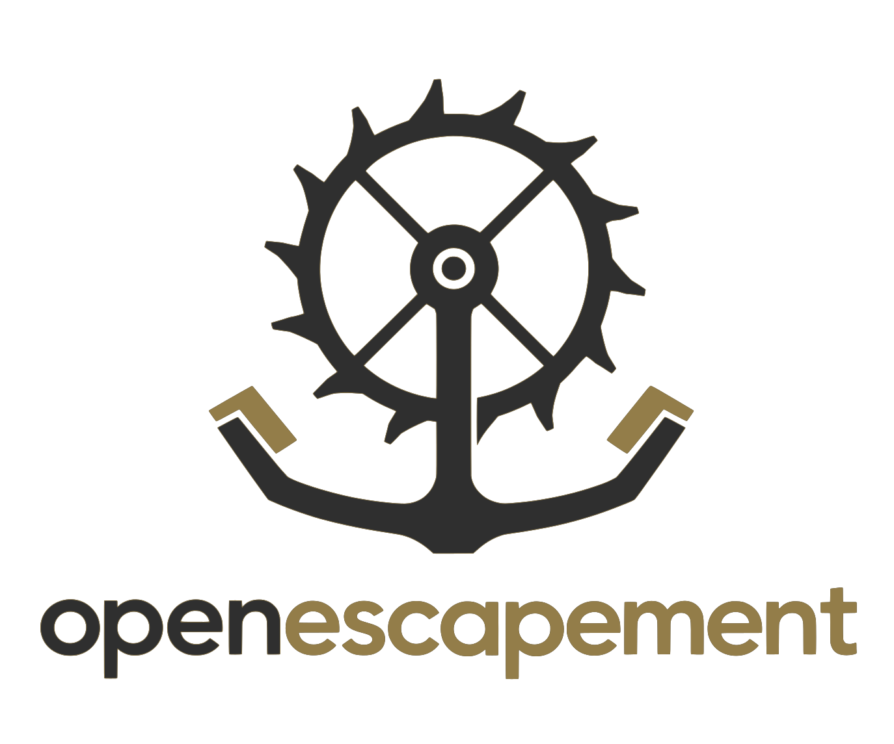

<p align="center"></p>

# OpenEscapement

**Deterministic governance for your AI usage.**

`esc` ships your organization's AI policy as versioned, signed **rule packs**, rendered directly into the files coding agents already read — `CLAUDE.md`, `AGENTS.md`, `GEMINI.md`, `.claude/skills/`, `.mcp.json` — plus a human-readable `GOVERNANCE.md`. Think **Dependabot-meets-dotfiles for AI policy**: one policy source, synced everywhere, drift-detected, reviewable in every PR.

```
┌──────────────────┐   git + signed tags   ┌───────────────────────────────┐
│  policy-packs    │ ────────────────────► │  your repo                    │
│  (one repo,      │      esc sync         │  CLAUDE.md   ◄ managed block  │
│   your org's     │                       │  AGENTS.md   ◄ managed block  │
│   rules)         │      esc status       │  GOVERNANCE.md  (for humans)  │
└──────────────────┘ ◄──────────────────── │  .claude/skills/  .mcp.json   │
                        drift detection    └───────────────────────────────┘
```

## Why

Every organization is adopting AI agents faster than it can govern them. The existing answers are policy PDFs nobody reads, or heavyweight compliance suites that fight how developers actually work.

But something changed with AI agents: for the first time, the "workers" being governed **natively read instruction files**. A rule written into `CLAUDE.md` isn't a policy document someone might read — it's literal text the agent consumes *every session*. Policy distribution channels that enforce themselves. OpenEscapement is built on that wedge:

> Make compliance easier than non-compliance. Ship the rules where the work happens. Give leadership one view of what's deployed.

And rule packs don't just constrain — they **teach**. A pack carries paved-path pointers ("SSO is at `sso.acme.example`, API keys come from here, secrets go in this vault"), so every agent becomes an ambassador for the central services your teams didn't know existed. Every vibe-coded POC gets steered onto the paved road automatically.

## Why "escapement"?

An [escapement](https://en.wikipedia.org/wiki/Escapement) is the mechanism in a clock that converts an unregulated power source into precise, countable ticks. That is exactly what this does for AI agents: enormous unregulated capability in, deterministic and auditable behavior out. Not a firewall, not a scanner — a regulator.

## Install

```sh
# Verified install (downloads, cosign-verifies, and installs the latest release):
curl -sSfL https://raw.githubusercontent.com/tensorgroup/openescapement/main/install.sh | bash

# Homebrew (published by the next tagged release; until then use the installer):
# brew install tensorgroup/tap/esc

# Or build from source:
go install github.com/tensorgroup/openescapement/cmd/esc@latest
```

Release binaries are cosign-signed with SLSA build-level-3 provenance — see
[VERIFYING.md](VERIFYING.md).

## Quickstart

```sh
cd your-repo
esc init                       # scaffold .escapement/config.yaml
# point it at a pack (see examples/packs/acme-org for a complete starter):
#   packs:
#     - source: github.com/your-org/policy-packs//org
#       ref: v1.0.0
esc sync                       # fetch → verify → render → write
esc status --check             # 0 = in sync; 1 = drift (add to CI)
```

Try it right now with the shipped example — no pack repo needed:

```sh
git clone https://github.com/tensorgroup/openescapement && cd openescapement/examples/governed-service
go run ../../cmd/esc sync && go run ../../cmd/esc status
```

### Adding `esc` to a repo that already has instruction files

Most first contact isn't a blank repo, it's one with a hand-written `CLAUDE.md` or
`AGENTS.md` already in place. `esc init` handles that case explicitly:

- **Detects** what's already there (`CLAUDE.md`, `AGENTS.md`, `GEMINI.md`,
  `GOVERNANCE.md`, `.mcp.json`, `.claude/skills/`) and pre-fills `targets` in the
  generated config with exactly what it found. A repo with `AGENTS.md` and no
  `GEMINI.md` doesn't get `GEMINI.md` conjured into existence by its first sync.
  Nothing detected leaves `targets` empty, which still means all targets.
- **Explains**, in the same vocabulary `esc status` uses, what the first `esc sync`
  will do to each detected file: your content is preserved byte for byte and
  reported as a local amendment. A file that already carries a managed block or the
  placeholder marker is told that instead of promised an insert it won't get.
- **Offers**, once, to place the managed-block marker (`<!-- escapement:block -->`),
  on a TTY. One question, defaulting to no: say no and nothing is written, and the
  block lands at the top of each file, below any frontmatter and title, at first
  sync. Say yes and you pick a position once, above the title (but still below any
  frontmatter) or at the end of the file, and it applies to every eligible file.
  Declining, an empty answer, Ctrl-D, and anything unrecognized all leave every file
  untouched; the placeholder is the only way to override where the block lands.

`esc init` never writes rendered policy, only the marker, and only when you ask it
to. A getting-started command shouldn't put rules into your instruction files before
you've seen them; `esc sync` is what writes policy, later, once you've reviewed the
pack.

Guard rails: init never writes over a file with uncommitted changes, because git is
what would restore it; that file is reported and left out of the offer, and the rest
are still offered. In a directory that is not a git repository there is no undo at
all, so the prompt says so and still requires an explicit yes rather than treating
"no version control" as the safest case. A non-interactive run, including
`esc init --yes`, never asks and never writes anything beyond the config scaffold.

Once a pack is synced, run its `esc-reconcile` skill, if it ships one (the seeded
demo pack does), to compare your existing rules against the pack's for duplicates or
contradictions. That comparison is judgment work for an agent: a CLI heuristic would
be wrong often enough to erode trust, and a model call would break `esc`'s
no-network, single-dependency design, so the guidance ships as a skill instead of
code in `esc` itself.

### Set up `esc` in a repo with your agent

Installing the binary is the whole install; the judgment is per repo. Paste this into
the coding agent you already use, from the root of the repo to govern (fill in the
first line):

```text
Set up OpenEscapement (esc) in this repo. My rule-pack repo is <git url or "none yet">;
the esc source checkout, if I have one, is at <path or "none">.

0. Confirm `esc version` works. If it does not, stop and tell me; the install comes
   first.
1. Read the instruction files already here (CLAUDE.md, AGENTS.md, GEMINI.md,
   .claude/skills/, .mcp.json) and tell me, section by section, what a pack would
   overlap with. esc preserves everything outside its managed block and reports it as
   a local amendment, so nothing of mine is lost; what I need from you is the list of
   subjects both will speak to, and a recommendation for each: keep mine, let the
   pack's rule stand, or take it to the pack as a PR.
2. Run `esc init --yes`. It scaffolds `.escapement/config.yaml`, pre-fills `targets`
   with the files it detected, and writes nothing else. If CLAUDE.md imports
   AGENTS.md, set `targets` to `agents` plus `skills` and `mcp`, so the block lands
   once and the pack's skills and MCP servers still render.
3. Point the config at my pack repo: a git source with a `ref` and a trusted signer in
   `allowed_signers`. If I have none yet, copy `examples/packs/acme-org` from the esc
   checkout (or `git clone https://github.com/tensorgroup/openescapement`) into a pack
   repo of my own next to this one, strip it to my rules before the first sync (its
   rules, paved paths, skill, and MCP entry belong to a fictional org), and point at
   it as a local path with `trust: unsigned` and no ref, as
   `examples/governed-service/.escapement/config.yaml` does.
4. Run `esc render --stdout` and show me what will land before it lands. Then
   `esc sync`, then `esc status --check`, and show me both outputs.
5. Add the GitHub Action from the README once the pack is a git source; it installs
   esc and runs `esc status --check` in a bare checkout, where a local sibling path
   does not exist. Skip it until then and say so.
6. Commit `.escapement/`, the rendered files, and the lockfile on a branch and open
   the PR. Never delete the lockfile to "reset"; it is what lets sync recognize a
   hand-edited block.
7. Keep a list of everything these docs did not tell you. I will send it upstream.
```

If you also run a per-user review panel, the sibling project's README carries the
matching prompt for a brand-new project; see the next section.

### Independently, or with Balancewheel

`esc` governs the repo. What configures *your* agent lives in your home directory:
the user-level `~/.claude/CLAUDE.md`, `~/.claude/skills/`, per-user wrappers and
credentials. `esc` never writes any of that. What it keeps under your home directory
is its own: a pack cache in the OS cache directory (`ESC_CACHE_DIR` overrides it) and,
for `esc serve`, its data under `~/.escapement/server`. Its one look at your agent's
configuration is a read: `esc status` notices a pack-provided skill whose name also exists under
`~/.claude/skills` and reports it as an informational `duplicate`, which never changes
an exit code. Your agent reads both the user-level file and the repo's file, so a
pack rule and a personal rule can disagree on the same subject. In a governed repo
the pack's rule is the org's call; adjust your own rule or open a PR against the pack
rather than editing the managed block: the edit reports as drift, `esc status --check`
fails, and `esc sync` declines to overwrite it until someone runs `--force`.

The sibling project [Balancewheel](https://github.com/tensorgroup/balancewheel) is
that per-user layer done deliberately: a moderated multi-model review panel, with
other vendors' CLI agents as read-only peer seats and a scoreboard that logs every
dispute. Each works without the other; together they close a loop.

- **`esc` only.** An org wants its rules in every repo's instruction files, signed and
  drift-checked. Nothing here needs a panel. The model packs under `examples/packs/`
  (`anthropic-models`, `openai-models`, `zai-models`) carry per-vendor model guidance
  with prices, the reason behind each status, and the condition that would reverse it;
  copy one into your pack repo and pin it.
- **Balancewheel only.** You want a review panel and a scoreboard for your own agent,
  and there is no org policy to ship. It installs once per machine, under the home
  directory only, and nothing in it needs `esc`.
- **Both.** The panel's log is where a seat policy earns its numbers (which model holds
  which seat, on what evidence), and a rule pack is what that policy becomes once it
  applies to more than one person. Install balancewheel once per machine, then `esc` in
  each repo; that order is a recommendation, not a dependency, since neither reads the
  other's state. `examples/packs/model-seats` is that policy in pack form: seats named
  by role, the substance bar, mandatory logging, and evidence-cited demotion with
  re-promotion criteria, with the models behind the seats a dated config detail.

### `esc serve` — the admin portal

For what the CLI, the pack repo, and the portal each do, and what a server adds,
see [docs/cli-and-portal.md](docs/cli-and-portal.md).

```sh
esc serve --demo               # one binary, seeded fictional org, no setup
```

Four pages: an overview of fleet posture, a fleet list of registered repos and their
drift status, rule-pack browsing with portal-side publishing (validate → commit → tag),
and usage. The portal never pushes rules into repos — packs it publishes still reach a
repo only when someone runs `esc sync` there, same as any other pack source.

`esc serve --demo` resets its example data to pristine on every startup and prints `esc: demo data reset`, so the demo always shows current content. Anything you change during a demo (published pack versions, adopted starters, guidance edits) is discarded when you restart. Non-demo servers keep your data and only refresh guidance files you have not edited.

Outside `--demo`, `esc serve` prints a fresh random bearer token on every start unless you pass `esc serve --token <token>` to set it explicitly (the same token repos need in `ESC_PORTAL_TOKEN` to publish to this server's ingest endpoint). `--demo` always disables auth, regardless of `--token`.

The portal is server-rendered with a strict CSP; its one third-party asset, htmx, is
vendored and embedded (pinned by SHA-256 in `internal/portal/web/HTMX-VENDOR.md`), never
fetched at runtime, and every interaction still works with JavaScript disabled.

The portal's **Models** section is curated, sourced guidance on each vendor's models (Anthropic, OpenAI, Google, Kimi, Deepseek, Grok): what each model class is good at, which roles it suits (planning, review, coding, bulk), how to govern it, and example rule-pack fragments to adopt. Every claim carries a source. The guidance ships embedded and is seeded to `<data-dir>/guidance/` on first run. Files you have not edited are refreshed to the latest embedded content on later runs, so upgrades reach you automatically; any file you edit by hand or from the portal is never overwritten. To restore a shipped file, delete it and restart. Raw HTML in guidance or fragment markdown is dropped by the safe renderer; write markdown.

## How it works

A **rule pack** is a directory in a git repo: a small manifest plus markdown rule fragments.

```yaml
# pack.yaml
schema: 1
name: acme-org
version: 1.4.0
rules: [rules/secrets.md, rules/hosting.md]     # markdown, rendered to agent files
skills: [skills/acme-vault]                     # → .claude/skills/
mcp:
  servers: { acme-paved-path: {command: npx, args: ["-y", "@acme/paved-path-mcp"]} }
catalog:                                        # preferred/allowed/review-required/banned
  - {name: Tailscale, category: hosting-exposure, status: preferred}
  - {name: Raw port forwarding, category: hosting-exposure, status: banned}
constraints:
  max_file_bytes: 32768                         # protect the agent's context budget
  forbidden_patterns: ["ignore (the )?governance"]
```

Shipped examples: `examples/packs/acme-org` is a complete org pack (rules, paved paths,
a catalog, a skill, an MCP server, constraints); `anthropic-models`, `openai-models`,
and `zai-models` are per-vendor model packs, each catalog entry carrying its price, the
reason for its status, and, where the status departs from the vendor's own default, the
condition that would reverse it; `model-seats` governs how several models collaborate,
by seat rather than by model.

`esc sync` renders packs into a **managed block** inside your existing files — everything outside the block stays yours:

```markdown
# CLAUDE.md                       ← your file, your content above the block

<!-- escapement:begin packs=acme-org@1.4.0 hash=sha256:9f2c… -->
> Managed by escapement. Do not edit. …policy text…
<!-- escapement:end -->
```

The `catalog` renders twice: concise directives for agents, and a readable table in `GOVERNANCE.md` so humans always know what's preferred, allowed, and banned — without hand-maintaining a policy doc.

| Command | What it does |
|---|---|
| `esc init` | Scaffold config in a repo |
| `esc sync` | Fetch pinned packs, verify, render, write, lock |
| `esc status --check` | Classify drift (altered / missing / stale / constraint-violated); non-zero exit for CI |
| `esc diff` | Unified diff of expected vs actual |
| `esc diff --against v2.0.0` | Review policy changes before updating a pin |
| `esc update --ref v2.0.0` | Bump the pin (then `esc diff`, PR, `esc sync`) |
| `esc render --stdout` | Preview without writing |

Plain `esc status` (no `--check`) exits 1 when a fail-closed constraint violation
exists, for example an unacknowledged custom target file. Ordinary drift and
orphaned managed blocks still exit 0 without `--check` and 1 with it; orphans are
self-healing, since the next sync removes the stale block.

### Local amendments

Content escapement does not own (text you add outside a managed block, extra
`.mcp.json` server entries, files you add to a skill directory) is never
touched by sync, and is reported on a second, independent axis: `local: none`
or `local: amended`. An amendment alone is never drift and never changes an
exit code. `esc status` calls a file with an in-sync managed block plus your
own additions **augmented**; that's expected use, not a problem to fix.

`esc sync` leaves an artifact alone when its managed region was hand-edited,
instead of overwriting it: it warns on stderr, records the skip, and still
exits 0. **Exit 0 from `esc sync` no longer asserts the repo matches
policy**: it asserts that everything escapement was willing to apply was
applied. Gate compliance on `esc status --check`, which exits 1 on any
artifact that is not in sync. Run `esc sync --force` to overwrite a
hand-edited managed region and converge; `--force` only touches content
escapement owns and never overwrites a local amendment.

If a pack manifest declares `reporting: { amendments: metrics, endpoint:
https://... }` (or `amendments: content`), a repo publishes local amendments
to that endpoint at that level on every `esc sync` and `esc status`; a
repo's own `.escapement/config.yaml` can lower the level via
`report_amendments: metrics` or `off`, but never raise it above what the
pack declared. With no `reporting` block, or a `reporting` block with no
`endpoint`, nothing is ever sent anywhere. This governs only what leaves the
repo: your own `esc status` always shows your amendments in full, including
content, on your own machine, regardless of the resolved level; see JSON
output below.

#### Publishing to the admin portal

Set `ESC_PORTAL_TOKEN` in the environment (never in config, so it can never
be committed) to authenticate publishes. Publishing is always non-fatal: it
runs after the lockfile is written and all normal output is printed, so a
telemetry outage never changes a command's exit code or suppresses its
output. An unset token with an endpoint configured is one stderr warning and
a skipped publish, not a failure. Anything that could not be sent queues to
the gitignored `.escapement/outbox.jsonl` (capped at 200 entries or 14 days,
oldest evicted first, every drop reported on stderr) and flushes oldest-first
on the next successful publish.

What leaves the repo depends on the resolved `reporting.amendments` level:

| Level | What leaves the repo |
|---|---|
| `off` (default, or no `reporting` block) | Nothing. Nothing is sent, ever. |
| `metrics` | Repo identity, pack pins, and every artifact's `managed`/`local` state, counts, hashes, and item names (e.g. which `.mcp.json` keys or skill-directory files were added). Never amendment content, alteration diffs, or free-text detail/reason prose. |
| `content` | Everything `metrics` sends, plus full amendment text and alteration diffs. |

### JSON output (`--json`)

`esc status --json` and `esc sync --json` print one JSON document (schema 1)
to stdout instead of human-readable output: the contract a separate
consumer (a portal, a dashboard, a script) can parse without reading Go
structs:

| Field | Type | Meaning |
|---|---|---|
| `schema` | int | Document schema version |
| `command` | string | `"status"` or `"sync"` |
| `packs[]` | array | One entry per pinned pack: `source`, `ref`, `pinned` (resolved content hash), `latest` (omitted if unknown), `signed` |
| `findings[]` | array | Every classified artifact, pack pin, or subsystem signal (see below) |
| `collection` | object | `amendments` (`off` / `metrics` / `content`) and `source` (`default` / `pack` / `repo-override`): the resolved reporting level and where it came from |
| `skipped[]` | array | `sync` only, always present (possibly `[]`); omitted entirely for `status`. What sync declined to write or remove: `subject`, `kind`, `cause`, `reason`, `expected_hash`, `actual_hash`. `cause` is the machine-readable discriminator (`hand-edited`, `orphan-dir-unmanaged`, `orphan-dir-edited`, `orphan-block-edited`); `reason` is prose for a human and nothing should branch on it |

Each `findings[]` entry carries `subject` (an artifact path, a pack source
URL, or the literal `"update-check"`), `kind` (`block` / `file` / `dir` /
`json-keys` for artifacts, or `pack` / `update-check` / `constraint`),
`managed` (the drift state), `local` (`none` / `amended`), `detail`, and
optional `amendment` / `alteration` objects.

Two things worth knowing before you parse this:

- **`subject` is not unique within `findings[]`.** A constraint-violation
  finding reuses an artifact's path, so key on `(subject, kind)`, not
  `subject` alone.
- **`--json` skips the interactive update check** on both commands, which
  for `status` also skips the update-log append: a consumer polling only
  `esc status --json` will never see a pack's `latest` field advance.
  `esc sync --json` still records a check entry every time, since sync
  always calls the recorder regardless of `--json`.

`amendment.content` and `alteration.diff` are both omitted for `.mcp.json`
(kind `json-keys`) and for skill directories (kind `dir`): a whole-file
`.mcp.json` diff would ship a user's own *unowned* MCP server entries into a
document a publisher forwards upstream, and a directory's alteration hashes
are a whole-tree pair with no single-file diff to show. Local surfaces
(`esc status`, `esc status --json`, `esc sync --json`) always report
complete local truth, amendment content included, no matter what the
resolved reporting level is. The level governs only what a publisher sends
onward, never what your own machine shows you.

See `docs/superpowers/specs/2026-08-05-local-amendment-model-design.md` §5
for the full field-level rationale.

There's also a GitHub Action:

```yaml
- uses: tensorgroup/openescapement@main
  # runs `esc status --check` — policy drift fails the build
```

### Custom targets

A pack may define extra managed-block markdown targets in `pack.yaml` under
`custom_targets`, so an org can govern files like
`.github/copilot-instructions.md` or `QWEN.md` without waiting for an esc
release:

```yaml
custom_targets:
  - name: copilot
    file: .github/copilot-instructions.md
    doc: https://docs.github.com/en/copilot/customizing-copilot
    description: Repository custom instructions for GitHub Copilot.
```

`name` matches `^[a-z][a-z0-9-]{0,31}$` and is used in fragment `targets:`;
`file` is a clean relative `.md` path of at most two segments, ASCII only, not
in a control directory. A fragment reaches a custom target only when it names
it explicitly; a fragment with no `targets:` goes to built-in files only.

**Single owner:** a custom target belongs to the one pack that defines it.
Only that pack's fragments render into it. Two packs declaring the same name
or file is an error and sync refuses. If an org and a team need to co-write
one file, put the fragments in the same pack.

A custom target renders only if its file is listed in the repo's
`.escapement/config.yaml`:

```yaml
allow_custom_target_files:
  - .github/copilot-instructions.md
```

Pinning a pack grants it write access to a known, fixed set of files. Custom
targets would let a pack choose new paths, so the acknowledgment list keeps a
repo's write surface enumerable from the repo's own config. Filename rules
alone are not enough because markdown transcludes (one instruction file can
pull in another), so a file the pack does not name directly could still change
what an agent reads. Without the acknowledgment, sync fails closed and names
the file to add.

Recommended layout: an org base pack plus team packs, each able to contribute
its own custom targets, with the repo acknowledging every file it wants
written:

```yaml
packs:
  - {source: git@github.com:acme/esc-org-base, ref: v2.1.0}      # org floor
  - {source: git@github.com:acme-payments/esc-team, ref: v0.3.0} # team additions
targets: []                                                       # optional filter
allow_custom_target_files:
  - .github/copilot-instructions.md                               # org base's target
  - PAYMENTS-AGENTS.md                                            # team's target
```

## Security model

This tool writes instructions that agents execute — its distribution channel is a high-value target, and it is designed fail-closed:

- **Signed packs.** Sources are signature-verified (`git verify-tag` against an SSH `allowed_signers` trust root) before a byte is used. Unsigned sources require an explicit, greppable `trust: unsigned` in config.
- **Hash-pinned lockfile.** `.escapement/escapement.lock` records resolved commit SHAs and content hashes. A moved tag or tampered fetch fails loudly (exit 3) before any write. It also carries what sync last wrote, which is how `esc sync` recognizes a hand-edited managed region and declines to overwrite it: deleting the lockfile erases that history, so the next sync treats every artifact as never-synced and overwrites every hand-edit. Don't delete it to "reset" a repo.
- **Explicit updates only.** Sync never auto-jumps versions. Policy changes arrive as reviewable diffs in normal PRs — your existing review, changelog, and notification machinery.
- **No standing write path.** No daemon, no server pushing into repos. Only `esc`, run by someone with write access, changes policy files.
- **Merge constraints.** Packs can bound the final merged file (max size, forbidden patterns like "ignore the governance section"), validated before writing.
- **Provenance everywhere.** Every managed block carries pack names, versions, and a content hash — any file on any machine audits back to its source.

## What this is not

- Not an enterprise AI-governance compliance suite — different altitude, different soul
- Not an AI firewall or gateway (those are integration partners)
- Not a code scanner — we verify gates exist; we don't run scans
- Not a model evaluation platform

## Status & roadmap

**v0.1 (this release):** rule-pack format, renderer, git-native sync with signatures + lockfile, drift detection, CI gate, six render targets, example pack.

**Next:** self-service project registry with expiry (the shadow-IT map), MCP server surface (live policy queries: *"am I allowed to open a port?"*), usage telemetry and dashboard, SIEM export, review workflows. See `ai-governance-product-spec.md` for the full picture.

## Development

```sh
go test ./...        # full suite — integration tests use real temp git repos
go vet ./... && gofmt -l .
```

Package layout: `internal/pack` (manifest + rule fragments), `internal/source` (git fetch, signature verify), `internal/render` (compose, managed blocks, governance, MCP merge, constraints), `internal/engine` (plan/apply/status/diff), `internal/cli`, plus `internal/config` and `internal/lockfile`.

Design docs live in `docs/superpowers/specs/`. The only external dependency is `gopkg.in/yaml.v3` — that's deliberate; see the security model.

Instructions for coding agents working on this repo live in [`AGENTS.md`](AGENTS.md) (`CLAUDE.md` imports it, so all agents read one source — the same convention `esc` enforces for its users). Vendor conventions for these files evolve; we track them in `docs/roadmap/vendor-guidance-tracking.md`.

## License

[Apache-2.0](LICENSE). The rule-pack format, renderer, CLI, and examples are open source and always will be — we want the format to become *the* way organizations express AI policy-as-artifacts. See `docs/strategy/licensing-and-open-core.md` for the reasoning. Copyright 2026 Tensor Group and William Zajac; the `NOTICE` file carries the attribution that downstream copies must keep.
